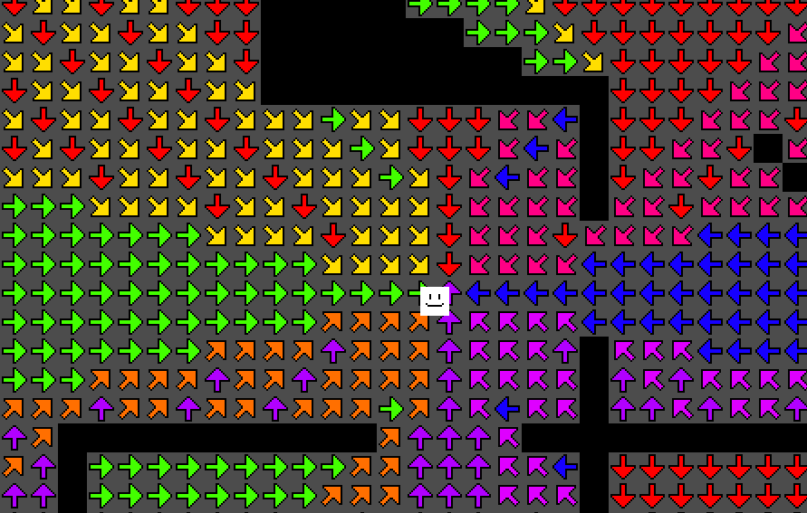
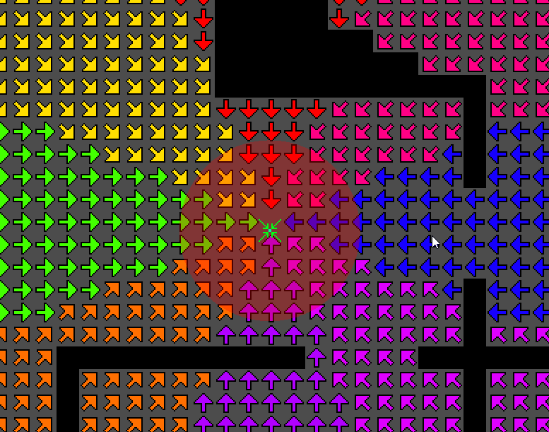
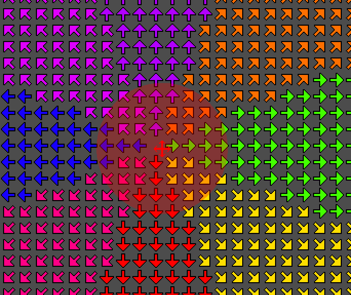

# 2D Flowfields

## Why did i choose Flowfields?
During the vacation is started playing Carrier Command 2, a naval strategy game. In the game the enemies on the islands move using flowfields. I found this out while looking a devlog of the game. I found it very interesting and wanted to try it out myself.

## What are Flowfields?
Flowfields are a way to move multiple agents in a game. It is a grid of vectors that point in the direction the agent should move. The vectors are generated using a pathfinding algorithm, such as BFS, A*. The flowfield is generated by first creating a cost field, which is a grid of values that represent the cost of moving through each cell to the target. The cost field is then used to generate the flowfield by calculating the direction of the lowest cost for each cell.
<!-- image -->

Then an agent can use the flowfield to move towards a target by following the vectors in the flowfield.

## BFS
BFS is a algorithm that is used to calculate the best path from a target to all other cells in the grid. It works by starting at the target cell and expanding outwards to all neighboring cells. Each time a cell is expanded, it is assigned a cost value that is one more than the cost value of the cell it was expanded from. This continues until all cells have been assigned a cost value. This leaves a grid with cost of each cell to the target.

## Implementation
I implemented the flowfield in Godot Engine. I make a grid of cells, each cell has a cost value and a vector value. The cost value is generated using BFS pathfinding algorithm. The flowfield is then generated by calculating the direction of the lowest cost for each cell. The agent can then use the flowfield to move towards a target by following the vectors in the flowfield.
To save on performance i only recalculate the flowfield when the target moves. The agents then sample the flowfield at their position to get the direction they should move in.

### Modifyers of the Cost Field
#### Walls
To make walls possible i just set the cost of the walls to a very high value.
I also experimented with making the walls have a "edge" around them by pointing the vectors away from the wall. This worked to a certain degree, but it also caused issues with doorways. So i decided to not include it in the final version.

#### Attractors
To make the agents go through a certain point i made attractors. They get calculated inside of the flowfield generation. They work by adding a direction to itself in the final calculation.

#### Repellers
They work the opposite of attractors. They subtract a direction from itself in the final calculation.

## Conclusion
2D Flowfields are a interesting way to handle lots of agents moving to a target. One downside i noticed is that the calculation of the flowfield can be quite expensive. Another downside is that there can only be one target at a time. You could combine multiple targets into one flowfield, but that would make the flowfield less accurate. Overall i think flowfields are a interesting way to handle multiple agents moving to a target.

## Demo
The demo project can be opened with [Godot 4.4](https://godotengine.org/download/windows) or higher. 

- WASD to move the camera
- The toggles to enable the grid visualization
- Bar at the right to zoom in and out
- The 3 sliders to change the strength of the BFS, Attractors and Repellers

## Sources
- Main idea [Flowfield in Games](https://www.youtube.com/watch?v=tVGixG_N_Pg)
- Expansion with Attractors and Repellers [Flowfields with Attractors and Repellers](https://www.youtube.com/watch?v=-DPhpyzjWKc)
- [Red Blob Games - Flowfields](https://www.redblobgames.com/pathfinding/tower-defense/)
